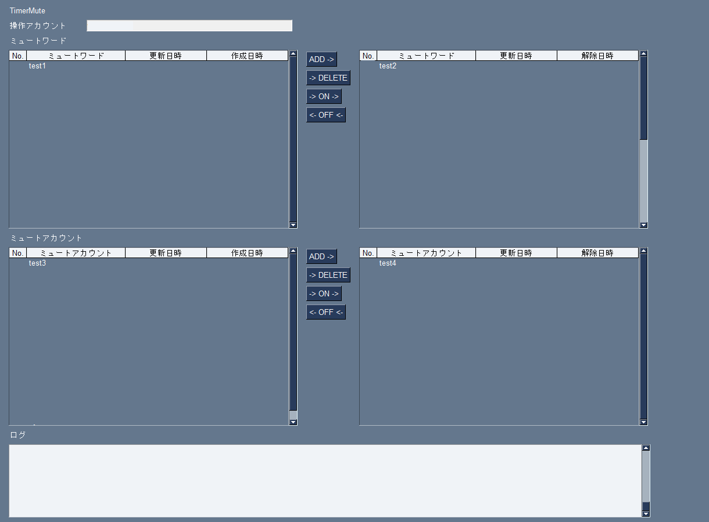

# ff-getter


## 外観


## 概要
- あるtwitterアカウントについて、キーワードミュートとユーザーのミュートをGUIで管理する。

## 特徴（できること）
- twitterのセッション情報を通してキーワードのミュート/ユーザーのミュートを行う。
    - デフォルトでは `設定とプライバシー->プライバシーと安全->ミュートとブロック` 配下の機能をGUI上から使用する形となる。
    - 追加機能として、解除するまでの時間を設定でき、解除時間になったらミュートを解除する機能がある。
        - ミュート解除は解除時間にこのアプリケーションが起動していないと行われないが、起動時に既に解除時間を過ぎている対象については解除を行う。

## 前提として必要なもの
- Pythonの実行環境(3.12以上)
- twitterのセッション情報
    - ブラウザでログイン済のアカウントについて、以下の値をクッキーから取得
        - ct0 (クッキー中)
        - auth_token (クッキー中)
        - screen_name(操作対象の@なしscreen_name)
    - ブラウザ上でのクッキーの確認方法
        - 各ブラウザによって異なるが、概ね `F12を押す→ページ更新→アプリケーションタブ→クッキー` で確認可能
    - 詳しくは「twitter クッキー ct0 auth_token」等で検索


## 使い方
1. このリポジトリをDL  
    - 右上の「Clone or download」->「Download ZIP」からDLして解凍  
1.  `./config/` にある `config_example.json` ファイルを `config.json` にリネーム  
1.   `config.json` ファイルの内容を編集する  
    -  `twitter_api_client` 配下にtwitterのセッション情報を設定する（必須）  
    -  `on_load` 配下を設定する（必須）  
        - 起動時にセッション読み込みをするか（ `prepare_session` ）  
        - 起動時に既に解除時間を過ぎている対象について解除をするか（ `restore_timer` ）  
1. `main.py` を実行する  
    ```
    python ./src/timer_mute/main.py
    ```
1. 外観で示したGUIが表示される  
1. GUI操作方法  
    - 対象アカウント：現在操作中のアカウント名（ `screen_name` ）が表示される。  
    - 上段がミュートワード。左上が過去にミュートワードとして指定したことがあるものの履歴、右上が現在ミュート中のワード一覧。  
    - 下段はミュートアカウント。左下が過去にミュートしたことがあるアカウントの履歴、右下が現在ミュート中のアカウント一覧。  
    - それぞれの中列にあるボタンで登録/削除等の操作を行う。
        - `ADD`：新規にミュートを追加する。ユーザーからの入力から現在ミュート中の一覧へ追加する。
        - `DELETE`：履歴を削除する。履歴からレコードを削除する。
        - `ON`：過去の履歴から再度ミュートを有効にする。履歴から現在ミュート中の一覧へ追加する。
        - `OFF`：現在ミュート中の一覧から選択してミュートを解除する。解除したレコードは履歴へ移動する。
    - ログ：操作時のログが表示される。  


## License/Author
- GNU Lesser General Public License v3.0（PySimpleGUIを使用している）  
- Copyright (c) 2022 - 2024 [shift](https://twitter.com/_shift4869)
